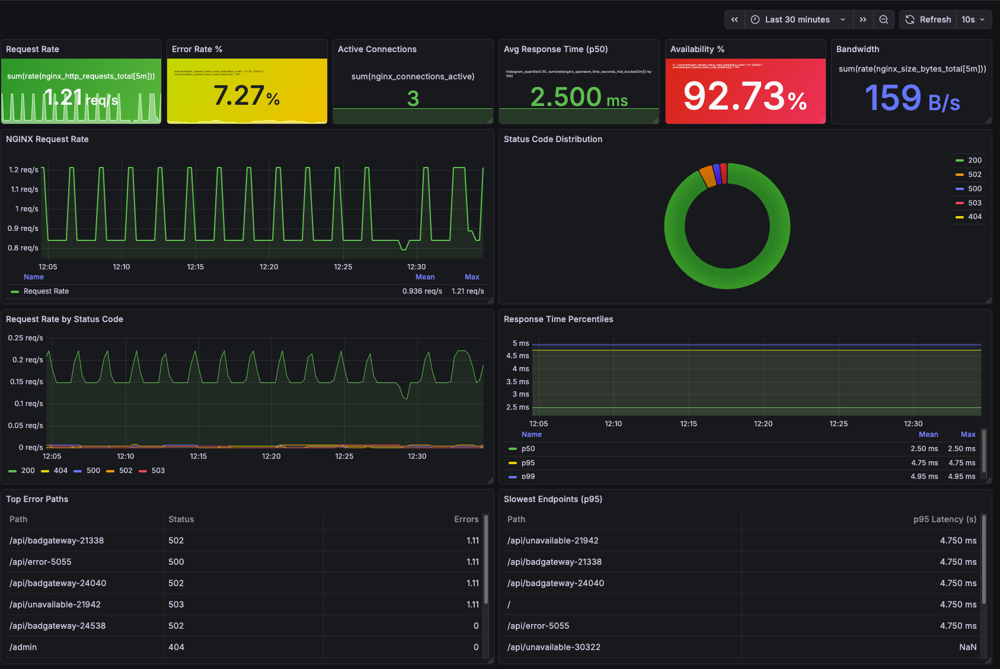
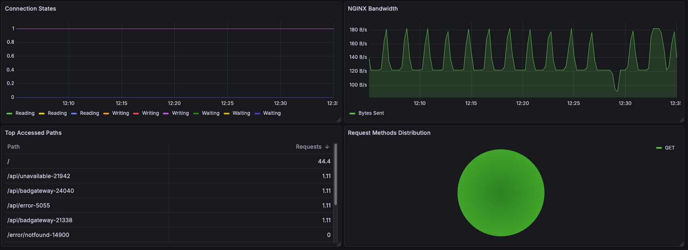

# NGINX Observability on Kubernetes

A complete NGINX observability solution running on Kind (Kubernetes in Docker) with dual metric collection sources: NGINX Prometheus Exporter and Fluentd log parsing.






## Architecture Overview

```
NGINX Pods (3 replicas)
  ├─ NGINX Container (port 80)
  │   └─ Custom log format with $upstream_response_time
  │       └─ Logs → /var/log/containers/*.log
  │
  └─ NGINX Exporter Sidecar (port 9113)
      └─ Exposes 9 real-time metrics from /nginx_status

                    ↓ (logs written to disk)

Fluentd DaemonSet (2 pods)
  ├─ Tail /var/log/containers/nginx-*.log
  ├─ Parse with regex → extract fields (method, path, status_code, size, urt)
  └─ Generate 3 custom metrics with rich labels (port 24231)

                    ↓ (both scraped)

Prometheus (kube-prometheus-stack)
  ├─ Scrapes NGINX Exporter → 9 operational metrics
  ├─ Scrapes Fluentd → 3 log-based metrics
  └─ ServiceMonitor discovery via label: release=kube-prometheus

                    ↓

Grafana (included in kube-prometheus-stack)
  └─ Visualization and dashboards
```

## Components

### Infrastructure
- **Kind v0.30.0**: Kubernetes 1.33.4 cluster
  - 1 control-plane node
  - 2 worker nodes
  - Cluster name: `nginx-observability`

### Helm Charts
- **Fluentd**: v0.5.3 (app v1.17.1) - DaemonSet for log collection
- **kube-prometheus-stack**: Prometheus Operator, Prometheus, Grafana
- **nginx-chart**: v0.1.0 - Custom NGINX with exporter sidecar

### Metrics Sources

See the [How Access Logs are Converted to Metrics](#-how-access-logs-are-converted-to-metrics) section below for detailed explanation of log parsing and metric generation.

#### 1. NGINX Prometheus Exporter (9 metrics)
Real-time operational metrics from `/nginx_status`:
- `nginx_connections_active`: Active client connections
- `nginx_connections_reading`: Connections reading requests
- `nginx_connections_writing`: Connections writing responses
- `nginx_connections_waiting`: Idle keepalive connections
- `nginx_http_requests_total`: Total HTTP requests
- `nginx_connections_accepted`: Accepted connections
- `nginx_connections_handled`: Handled connections
- `nginxexporter_build_info`: Exporter version info
- `up`: Exporter health status

#### 2. Fluentd Log-Based Metrics (3 metrics)
Parsed from NGINX access logs with rich labels (see [detailed explanation](#-how-access-logs-are-converted-to-metrics)):
- `nginx_size_bytes_total`: Total response bytes
- `nginx_request_status_code_total`: Requests by status code
- `nginx_upstream_time_seconds_hist`: Response time distribution

## Data Flow

### Log Collection Pipeline

1. **NGINX writes logs** to stdout with custom format
2. **Kubernetes captures** logs to `/var/log/containers/nginx-*.log`
3. **Fluentd DaemonSet tails** log files using tail plugin
4. **Regex parser extracts** structured fields:
   ```ruby
   /^(?<timestamp>.+) (?<stream>stdout|stderr)( (.))? (?<remote>[^ ]*) (?<host>[^ ]*) (?<user>[^ ]*) \[(?<time>[^\]]*)\] \"(?<method>\w+)(?:\s+(?<path>[^\"]*?)(?:\s+\S*)?)?\" (?<status_code>[^ ]*) (?<size>[^ ]*)(?:\s"(?<referer>[^\"]*)") "(?<agent>[^\"]*)" (?<urt>[^ ]*)$/
   ```
5. **Prometheus filter** generates metrics from parsed fields
6. **Prometheus scrapes** Fluentd metrics endpoint (`:24231/metrics`)

## 📊 How Access Logs are Converted to Metrics

This section explains the complete transformation process from NGINX access logs to Prometheus metrics.

### NGINX Log Format

NGINX is configured with a custom log format that captures essential request information:

```nginx
log_format custom_format '$remote_addr - $remote_user [$time_local] '
                        '"$request" $status $body_bytes_sent '
                        '"$http_referer" "$http_user_agent" '
                        '$upstream_response_time';
```

**Example log line:**
```
10.244.1.30 - - [09/Dec/2025:11:42:15 +0000] "GET /api/error-12345 HTTP/1.1" 500 22 "-" "curl/8.17.0" -
```

**Log Fields:**
- `$remote_addr` (10.244.1.30): Client IP address
- `$remote_user` (-): Authenticated user (if any)
- `$time_local` ([09/Dec/2025:11:42:15 +0000]): Request timestamp
- `$request` ("GET /api/error-12345 HTTP/1.1"): HTTP method, path, and protocol
- `$status` (500): HTTP status code
- `$body_bytes_sent` (22): Response size in bytes
- `$http_referer` (-): Referer header
- `$http_user_agent` (curl/8.17.0): User agent
- `$upstream_response_time` (-): Backend response time (if proxied)

### Kubernetes Log Enrichment

Kubernetes wraps the NGINX log with metadata when writing to `/var/log/containers/`:

```
2025-12-09T11:42:15.123456789Z stdout F 10.244.1.30 - - [09/Dec/2025:11:42:15 +0000] "GET /api/error-12345 HTTP/1.1" 500 22 "-" "curl/8.17.0" -
```

**Kubernetes adds:**
- Timestamp (2025-12-09T11:42:15.123456789Z)
- Stream (stdout/stderr)
- Flags (F = full line)

### Fluentd Parsing

Fluentd's regex parser extracts structured fields from the combined Kubernetes + NGINX log:

**Regex Pattern:**
```ruby
/^(?<timestamp>.+) (?<stream>stdout|stderr)( (.))? (?<remote>[^ ]*) (?<host>[^ ]*) (?<user>[^ ]*) \[(?<time>[^\]]*)\] \"(?<method>\w+)(?:\s+(?<path>[^\"]*?)(?:\s+\S*)?)?\" (?<status_code>[^ ]*) (?<size>[^ ]*)(?:\s"(?<referer>[^\"]*)") "(?<agent>[^\"]*)" (?<urt>[^ ]*)$/
```

**Extracted Fields:**
- `timestamp`: 2025-12-09T11:42:15.123456789Z
- `stream`: stdout
- `remote`: 10.244.1.30
- `method`: GET
- `path`: /api/error-12345
- `status_code`: 500
- `size`: 22
- `agent`: curl/8.17.0
- `urt`: - (upstream response time)

### Metric Generation

Fluentd's Prometheus filter transforms the parsed fields into three metrics:

#### 1. **nginx_size_bytes_total** (Counter)

**Purpose:** Track total bytes sent in HTTP responses

**Field Mapping:**
- Uses: `size` field (22 bytes)
- Type: Counter (increments by size value)
- Labels: None

**Example:**
```
# Before request
nginx_size_bytes_total 1000.0

# After processing log line with size=22
nginx_size_bytes_total 1022.0
```

**Configuration:**
```yaml
<metric>
  name nginx_size_bytes_total
  type counter
  desc nginx bytes sent
  key size
</metric>
```

#### 2. **nginx_request_status_code_total** (Counter)

**Purpose:** Count requests by HTTP status code, method, and path

**Field Mapping:**
- Uses: `method`, `path`, `status_code` fields
- Type: Counter (increments by 1 for each request)
- Labels: method=GET, path=/api/error-12345, status_code=500

**Example:**
```
# Before request
nginx_request_status_code_total{method="GET",path="/api/error-12345",status_code="500"} 5.0

# After processing log line
nginx_request_status_code_total{method="GET",path="/api/error-12345",status_code="500"} 6.0
```

**Configuration:**
```yaml
<metric>
  name nginx_request_status_code_total
  type counter
  desc nginx request status code
  <labels>
    method ${method}
    path ${path}
    status_code ${status_code}
  </labels>
</metric>
```

#### 3. **nginx_upstream_time_seconds_hist** (Histogram)

**Purpose:** Measure backend response time distribution

**Field Mapping:**
- Uses: `urt` field (upstream response time)
- Type: Histogram (buckets: 0.005, 0.01, 0.025, 0.05, 0.1, 0.25, 0.5, 1.0, 2.5, 5.0, 10.0)
- Labels: method=GET, path=/api/error-12345, status_code=500

**Example:**
```
# If urt = 0.15 seconds
nginx_upstream_time_seconds_hist_bucket{method="GET",path="/api/error-12345",status_code="500",le="0.1"} 5
nginx_upstream_time_seconds_hist_bucket{method="GET",path="/api/error-12345",status_code="500",le="0.25"} 6
nginx_upstream_time_seconds_hist_sum{method="GET",path="/api/error-12345",status_code="500"} 0.85
nginx_upstream_time_seconds_hist_count{method="GET",path="/api/error-12345",status_code="500"} 6
```

**Configuration:**
```yaml
<metric>
  name nginx_upstream_time_seconds_hist
  type histogram
  desc Histogram of the total time spent on receiving the response from the upstream server
  key urt
  <labels>
    method ${method}
    path ${path}
    status_code ${status_code}
  </labels>
</metric>
```

### Complete Transformation Example

**Input (NGINX Log):**
```
10.244.1.30 - - [09/Dec/2025:11:42:15 +0000] "GET /api/error-12345 HTTP/1.1" 500 22 "-" "curl/8.17.0" -
```

**Output (Prometheus Metrics):**
```
# HELP nginx_size_bytes_total nginx bytes sent
# TYPE nginx_size_bytes_total counter
nginx_size_bytes_total 1022.0

# HELP nginx_request_status_code_total nginx request status code
# TYPE nginx_request_status_code_total counter
nginx_request_status_code_total{method="GET",path="/api/error-12345",status_code="500"} 6.0

# HELP nginx_upstream_time_seconds_hist Histogram of the total time spent on receiving the response from the upstream server
# TYPE nginx_upstream_time_seconds_hist histogram
nginx_upstream_time_seconds_hist_bucket{method="GET",path="/api/error-12345",status_code="500",le="0.005"} 0
nginx_upstream_time_seconds_hist_bucket{method="GET",path="/api/error-12345",status_code="500",le="0.01"} 0
nginx_upstream_time_seconds_hist_bucket{method="GET",path="/api/error-12345",status_code="500",le="+Inf"} 6
nginx_upstream_time_seconds_hist_sum{method="GET",path="/api/error-12345",status_code="500"} 0.0
nginx_upstream_time_seconds_hist_count{method="GET",path="/api/error-12345",status_code="500"} 6
```

### Field-to-Metric Mapping Table

| NGINX Log Field | Fluentd Field | Metric Name | Metric Type | Usage |
|-----------------|---------------|-------------|-------------|-------|
| `$body_bytes_sent` | `size` | `nginx_size_bytes_total` | Counter | Counter value |
| `$request` (method) | `method` | `nginx_request_status_code_total` | Counter | Label |
| `$request` (path) | `path` | `nginx_request_status_code_total` | Counter | Label |
| `$status` | `status_code` | `nginx_request_status_code_total` | Counter | Label |
| `$upstream_response_time` | `urt` | `nginx_upstream_time_seconds_hist` | Histogram | Histogram value |
| `$request` (method) | `method` | `nginx_upstream_time_seconds_hist` | Histogram | Label |
| `$request` (path) | `path` | `nginx_upstream_time_seconds_hist` | Histogram | Label |
| `$status` | `status_code` | `nginx_upstream_time_seconds_hist` | Histogram | Label |

### Why This Approach?

**Advantages:**
1. **Rich Labels**: Per-endpoint, per-method, per-status-code granularity
2. **Historical Data**: Counters preserve all historical request data
3. **Flexible Analysis**: Can aggregate, filter, and slice metrics in Prometheus
4. **Low Cardinality Risk**: Only creates metrics for accessed endpoints
5. **Latency Distribution**: Histograms enable percentile calculations (p50, p95, p99)

**Trade-offs:**
- Slight delay (log write → parse → scrape cycle)
- Higher cardinality than simple counters (but manageable)
- Requires regex pattern maintenance if log format changes

### 📈 Complete Metrics Comparison Table

#### NGINX Exporter Metrics (9 total)

| Metric Name | Type | Description | Labels | Use Case |
|-------------|------|-------------|--------|----------|
| `nginx_connections_active` | Gauge | Active client connections | None | Monitor current load |
| `nginx_connections_reading` | Gauge | Connections reading requests | None | Request processing |
| `nginx_connections_writing` | Gauge | Connections writing responses | None | Response processing |
| `nginx_connections_waiting` | Gauge | Idle keepalive connections | None | Connection pooling |
| `nginx_http_requests_total` | Counter | Total HTTP requests | None | Overall traffic volume |
| `nginx_connections_accepted` | Counter | Accepted connections | None | Connection success rate |
| `nginx_connections_handled` | Counter | Handled connections | None | Processing capacity |
| `nginxexporter_build_info` | Gauge | Exporter version info | `version`, `gitCommit` | Version tracking |
| `up` | Gauge | Exporter health status | None | Availability monitoring |

#### Fluentd Log-Based Metrics (3 total)

| Metric Name | Type | Description | Labels | Use Case |
|-------------|------|-------------|--------|----------|
| `nginx_size_bytes_total` | Counter | Total bytes sent in responses | `method`, `path`, `status_code` | Bandwidth per endpoint |
| `nginx_request_status_code_total` | Counter | Request count by status code | `method`, `path`, `status_code` | Error rate analysis |
| `nginx_upstream_time_seconds_hist` | Histogram | Backend response time distribution | `method`, `path`, `status_code` | Latency percentiles |

#### Key Differences: Exporter vs Fluentd Metrics

| Aspect | NGINX Exporter | Fluentd |
|--------|----------------|---------|
| **Source** | `/nginx_status` endpoint | Access log parsing |
| **Timing** | Real-time | Log-based (slight delay) |
| **Granularity** | Global counters | Per-request with labels |
| **Labels** | Minimal (version info only) | Rich: method, path, status_code |
| **Use Case** | Overall health/traffic | Request analysis, debugging |
| **Latency** | Not available | Histogram from $upstream_response_time |
| **Metric Count** | 9 metrics | 3 metrics |
| **Overhead** | Very low (single endpoint) | Higher (log parsing) |

## Quick Start

### Prerequisites
```bash
# Install Kind
brew install kind

# Install Helm
brew install helm

# Install kubectl
brew install kubectl
```

### 1. Create Kind Cluster
```bash
kind create cluster --config kind-config.yaml
```

### 2. Run Installation Script
```bash
chmod +x init.sh
./init.sh
```

This will install:
- Fluentd DaemonSet with custom configuration
- kube-prometheus-stack (Prometheus + Grafana)
- NGINX Helm chart with exporter sidecar

### 3. Verify Installation
```bash
# Check all pods are running
kubectl get pods -A

# Check Helm releases
helm list

# Check Fluentd pods
kubectl get pods -l app.kubernetes.io/name=fluentd

# Check NGINX pods
kubectl get pods -l app.kubernetes.io/name=nginx-chart

# Check Prometheus
kubectl get pods -n monitoring -l app.kubernetes.io/name=prometheus
```

### 4. Access Services

#### Grafana
```bash
kubectl port-forward -n monitoring svc/kube-prometheus-grafana 3000:80
```
- URL: http://localhost:3000
- Username: `admin`
- Password: `prom-operator`

#### Prometheus
```bash
kubectl port-forward -n monitoring svc/kube-prometheus-kube-prome-prometheus 9090:9090
```
- URL: http://localhost:9090

#### NGINX Exporter Metrics
```bash
kubectl port-forward svc/nginx-server-nginx-chart 9113:9113
curl http://localhost:9113/metrics
```

#### Fluentd Metrics
```bash
kubectl port-forward svc/my-fluentd-release 24231:24231
curl http://localhost:24231/metrics
```

## Configuration Files

### Fluentd Configuration (`fluentd-values.yaml`)

#### Sources (04_sources.conf)
- Monitors Fluentd itself with `prometheus_tail_monitor`
- Tails container logs from `/var/log/containers/*.log`
- Parses logs with regex to extract fields
- Outputs to Fluentd metrics plugin

#### Filters (04_filters.conf)
- Matches logs from tag `kubernetes.**`
- Generates three Prometheus metrics:
  1. Counter for response size
  2. Counter for status codes
  3. Histogram for upstream latency

### NGINX Chart Files

- **Chart.yaml**: Helm chart metadata
- **values.yaml**: Configuration including custom log format
- **templates/deployment.yaml**: NGINX + exporter sidecar
- **templates/service.yaml**: Service exposing ports 80 and 9113
- **templates/configmap.yaml**: NGINX configuration with custom log format
- **templates/servicemonitor.yaml**: Prometheus discovery configuration

## Useful Commands

### Testing Metrics

```bash
# Generate traffic to NGINX
kubectl run curl-test --image=curlimages/curl --rm -it --restart=Never -- \
  sh -c 'for i in $(seq 1 100); do curl -s http://nginx-server-nginx-chart; done'

# Query Prometheus for Fluentd metrics
kubectl run curl-test --image=curlimages/curl --rm -it --restart=Never -- \
  curl -s http://kube-prometheus-kube-prome-prometheus.monitoring:9090/api/v1/query?query=nginx_request_status_code_total

# Check Fluentd logs
kubectl logs -l app.kubernetes.io/name=fluentd -f
```

### Debugging

```bash
# Check Fluentd configuration
kubectl exec -it <fluentd-pod> -- cat /etc/fluent/config.d/04_sources.conf
kubectl exec -it <fluentd-pod> -- cat /etc/fluent/config.d/04_filters.conf

# Check NGINX configuration
kubectl exec -it <nginx-pod> -c nginx -- cat /etc/nginx/conf.d/default.conf

# Check ServiceMonitors
kubectl get servicemonitor
kubectl describe servicemonitor nginx-server-nginx-chart
kubectl describe servicemonitor my-fluentd-release
```

### Cleanup

```bash
# Delete Kind cluster
kind delete cluster --name nginx-observability

# Or uninstall Helm releases
helm uninstall nginx-server
helm uninstall my-fluentd-release
helm uninstall -n monitoring kube-prometheus
```

## Troubleshooting

### Common Issues

1. **Admission Webhook ImagePullBackOff in Kind**
   - Solution: Disable webhooks in kube-prometheus-stack
   - Flag: `--set prometheusOperator.admissionWebhooks.enabled=false`

2. **Helm Upgrade Timeout**
   - Solution: Uninstall and reinstall instead of upgrade
   - Command: `helm uninstall <release> && helm install <release> ...`

3. **Fluentd Not Parsing Logs**
   - Check regex pattern matches log format exactly
   - Verify volume mounts: `/var/log` and `/var/lib/docker/containers`

4. **Metrics Not Appearing in Prometheus**
   - Verify ServiceMonitor has label: `release: kube-prometheus`
   - Check Prometheus targets: Prometheus UI → Status → Targets

## PromQL Examples

```promql
# Request rate by status code
rate(nginx_request_status_code_total[5m])

# Error rate (4xx + 5xx)
sum(rate(nginx_request_status_code_total{status_code=~"4..|5.."}[5m]))

# 95th percentile latency
histogram_quantile(0.95, rate(nginx_upstream_time_seconds_hist_bucket[5m]))

# Total bytes sent
sum(nginx_size_bytes_total)

# Active connections (from exporter)
nginx_connections_active
```

## Technical Specifications

- **Kubernetes Version**: 1.33.4
- **Kind Image**: kindest/node:v1.33.4@sha256:0d7006c83f8dcbd353cce0c131b046619f83464408f088036a1ed538e0d67fc4
- **NGINX Image**: nginx:latest
- **NGINX Exporter Image**: nginx/nginx-prometheus-exporter:0.10.0
- **Fluentd Chart Version**: 0.5.3
- **Fluentd App Version**: 1.17.1

## License

MIT
