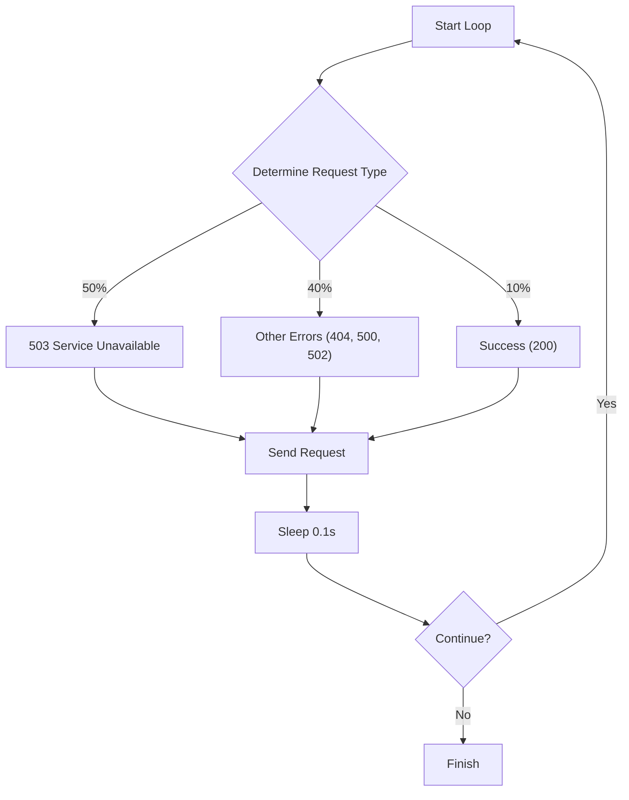

# NGINX Observability on Kubernetes

A complete NGINX observability solution running on Kind (Kubernetes in Docker) with dual metric collection sources: NGINX Prometheus Exporter and Fluent Bit log parsing.


## Architecture Overview

```
NGINX Pods (3 replicas)
  ├─ NGINX Container (port 80)
  │   └─ Custom log format with $upstream_response_time
  │       └─ Logs → /var/log/containers/*.log
  │
  └─ NGINX Exporter Sidecar (port 9113)
      └─ Exposes 9 real-time metrics from /nginx_status

                    ↓ (logs written to disk)

Fluent Bit DaemonSet (DaemonSet)
  ├─ Tail /var/log/containers/nginx-*.log
  ├─ Parse with regex → extract fields (method, path, status, size, urt)
  └─ Generate 3 custom metrics with rich labels (port 2021)

                    ↓ (both scraped)

Prometheus (kube-prometheus-stack)
  ├─ Scrapes NGINX Exporter → 9 operational metrics
  ├─ Scrapes Fluent Bit → 3 log-based metrics
  └─ ServiceMonitor discovery via label: release=kube-prometheus

                    ↓

Grafana (included in kube-prometheus-stack)
  └─ Visualization and dashboards
```

## Why Fluent Bit?

In this architecture, we chose **Fluent Bit** over Fluentd for the log collection and metric conversion layer. Here is why:

1.  **Lightweight & Efficient**: Fluent Bit is written in C, making it extremely lightweight (low memory and CPU footprint). This is ideal for a DaemonSet that runs on every node in the cluster, ensuring minimal overhead on your infrastructure.
2.  **High Performance**: It is designed to handle high throughput with low latency, which is critical when processing access logs in real-time to generate metrics.
3.  **Built-in Metric Generation**: Fluent Bit has a native `log_to_metrics` filter plugin. This allows us to generate Prometheus metrics directly from log streams without needing complex external plugins or sidecars.
4.  **Simplicity**: The configuration is straightforward and declarative, making it easier to maintain and deploy compared to the more complex Ruby-based configuration of Fluentd.

## Components

### Infrastructure
- **Kind**: Kubernetes cluster
  - 1 control-plane node
  - 2 worker nodes
  - Cluster name: `nginx-observability`

### Helm Charts
- **Fluent Bit**: v0.48.0 (app v3.2.2) - DaemonSet for log collection and metric generation
- **kube-prometheus-stack**: Prometheus Operator, Prometheus, Grafana
- **nginx-chart**: v0.1.0 - Custom NGINX with exporter sidecar

### Metrics Sources

#### 1. NGINX Prometheus Exporter (9 metrics)
Real-time operational metrics from `/nginx_status`:
- `nginx_connections_active`: Active client connections
- `nginx_connections_reading`: Connections reading requests
- `nginx_connections_writing`: Connections writing responses
- `nginx_connections_waiting`: Idle keepalive connections
- `nginx_http_requests_total`: Total HTTP requests
- `nginx_connections_accepted`: Accepted connections
- `nginx_connections_handled`: Handled connections
- `nginxexporter_build_info`: Exporter version info
- `up`: Exporter health status

#### 2. Fluent Bit Log-Based Metrics (3 metrics)
Parsed from NGINX access logs with rich labels:
- `nginx_bytes_sent`: Total response bytes
- `nginx_request_status_code_total`: Requests by status code
- `nginx_upstream_time_seconds`: Response time distribution (Histogram)

## Data Flow


### Log Collection Pipeline

1. **NGINX writes logs** to stdout with custom format
2. **Kubernetes captures** logs to `/var/log/containers/nginx-*.log`
3. **Fluent Bit DaemonSet tails** log files using `tail` input plugin
4. **Regex parser extracts** structured fields using `nginx_custom` parser
5. **Log to Metrics Filter** generates Prometheus metrics from parsed fields
6. **Prometheus Exporter Output** exposes metrics on port `2021`
7. **Prometheus scrapes** Fluent Bit metrics endpoint (`:2021/metrics`)

## How Access Logs are Converted to Metrics

This section explains the complete transformation process from NGINX access logs to Prometheus metrics.

### NGINX Log Format

NGINX is configured with a custom log format that captures essential request information:

```nginx
log_format custom_format '$remote_addr - $remote_user [$time_local] '
                        '"$request" $status $body_bytes_sent '
                        '"$http_referer" "$http_user_agent" '
                        '$upstream_response_time $hostname {{ .Values.serviceType }}';
```

**Example log line:**
```
10.244.1.30 - - [09/Dec/2025:11:42:15 +0000] "GET /api/error-12345 HTTP/1.1" 500 22 "-" "curl/8.17.0" 0.001 nginx-server-nginx-chart-7c584d88c-k69fq api-gateway
```

**Log Fields:**
- `$remote_addr` (10.244.1.30): Client IP address
- `$remote_user` (-): Authenticated user (if any)
- `$time_local` ([09/Dec/2025:11:42:15 +0000]): Request timestamp
- `$request` ("GET /api/error-12345 HTTP/1.1"): HTTP method, path, and protocol
- `$status` (500): HTTP status code
- `$body_bytes_sent` (22): Response size in bytes
- `$http_referer` (-): Referer header
- `$http_user_agent` (curl/8.17.0): User agent
- `$upstream_response_time` (0.001): Backend response time (if proxied)
- `$hostname` (nginx-server-nginx-chart-7c584d88c-k69fq): Pod name
- `{{ .Values.serviceType }}` (api-gateway): Service type label

### Kubernetes Log Enrichment

Kubernetes wraps the NGINX log with metadata when writing to `/var/log/containers/`:

```
2025-12-09T11:42:15.123456789Z stdout F 10.244.1.30 - - [09/Dec/2025:11:42:15 +0000] "GET /api/error-12345 HTTP/1.1" 500 22 "-" "curl/8.17.0" -
```

**Kubernetes adds:**
- Timestamp (2025-12-09T11:42:15.123456789Z)
- Stream (stdout/stderr)
- Flags (F = full line)

## Configuration

### Fluent Bit Configuration (`fluent-bit/values.yaml`)

The configuration is divided into Inputs, Filters, and Outputs.

#### Input
Tails the container logs from the node.

```yaml
[INPUT]
    Name tail
    Path /var/log/containers/*_nginx-*.log
    Parser cri
    Tag kube.*
    Mem_Buf_Limit 5MB
    Skip_Long_Lines On
```

#### Parser
Extracts fields from the NGINX log line.

```yaml
[PARSER]
    Name nginx_custom
    Format regex
    Regex ^(?<remote_addr>[^ ]*) - (?<remote_user>[^ ]*) \[(?<time_local>[^\]]*)\] "(?<method>\S+)(?: +(?<path>[^\"]*?)(?: +\S*)?)?" (?<status>[^ ]*) (?<body_bytes_sent>[^ ]*) "(?<http_referer>[^\"]*)" "(?<http_user_agent>[^\"]*)" (?<upstream_response_time>[^ ]*) (?<hostname>[^ ]*) (?<service_type>[^ ]*)
    Types body_bytes_sent:integer upstream_response_time:float
```

#### Filters (Parsing & Metric Generation)
First, apply the parser to the log message, then convert fields into Prometheus metrics.

```yaml
[FILTER]
    Name parser
    Match kube.*
    Key_Name message
    Parser nginx_custom
    Reserve_Data On

[FILTER]
    Name log_to_metrics
    Match kube.*
    Tag nginx_metrics
    Metric_Mode counter
    Metric_Name nginx_bytes_sent
    Metric_Description nginx bytes sent
    Value_Field body_bytes_sent
    Label_Field service_type
    Label_Field hostname

[FILTER]
    Name log_to_metrics
    Match kube.*
    Tag nginx_metrics
    Metric_Mode counter
    Metric_Name nginx_request_status_code_total
    Metric_Description nginx request status code
    Label_Field method
    Label_Field path
    Label_Field status
    Label_Field service_type
    Label_Field hostname

[FILTER]
    Name log_to_metrics
    Match kube.*
    Tag nginx_metrics
    Metric_Mode histogram
    Metric_Name nginx_upstream_time_seconds
    Metric_Description Histogram of the total time spent on receiving the response from the upstream server
    Value_Field upstream_response_time
    Label_Field method
    Label_Field path
    Label_Field status
    Label_Field service_type
    Label_Field hostname
    Bucket 0.01, 0.05, 0.1, 0.2, 0.5, 1.0, 2.0, 5.0, 10.0
```

#### Output
Exposes the generated metrics to Prometheus.

```yaml
[OUTPUT]
    Name prometheus_exporter
    Match nginx_metrics
    Host 0.0.0.0
    Port 2021
```

## 📈 Complete Metrics Comparison Table

### NGINX Exporter Metrics (9 total)

| Metric Name | Type | Description | Labels | Use Case |
|-------------|------|-------------|--------|----------|
| `nginx_connections_active` | Gauge | Active client connections | None | Monitor current load |
| `nginx_connections_reading` | Gauge | Connections reading requests | None | Request processing |
| `nginx_connections_writing` | Gauge | Connections writing responses | None | Response processing |
| `nginx_connections_waiting` | Gauge | Idle keepalive connections | None | Connection pooling |
| `nginx_http_requests_total` | Counter | Total HTTP requests | None | Overall traffic volume |
| `nginx_connections_accepted` | Counter | Accepted connections | None | Connection success rate |
| `nginx_connections_handled` | Counter | Handled connections | None | Processing capacity |
| `nginxexporter_build_info` | Gauge | Exporter version info | `version`, `gitCommit` | Version tracking |
| `up` | Gauge | Exporter health status | None | Availability monitoring |

### Fluent Bit Log-Based Metrics (3 total)

| Metric Name | Type | Description | Labels | Use Case |
|-------------|------|-------------|--------|----------|
| `log_metric_counter_nginx_bytes_sent` | Counter | Total bytes sent in responses | `hostname`, `service_type` | Bandwidth per pod/service |
| `log_metric_counter_nginx_request_status_code_total` | Counter | Request count by status code | `method`, `path`, `status`, `hostname`, `service_type` | Error rate analysis per pod/service |
| `log_metric_histogram_nginx_upstream_time_seconds` | Histogram | Backend response time distribution | `method`, `path`, `status`, `hostname`, `service_type` | Latency percentiles per pod/service |

### Key Differences: Exporter vs Fluent Bit Metrics

| Aspect | NGINX Exporter | Fluent Bit |
|--------|----------------|------------|
| **Source** | `/nginx_status` endpoint | Access log parsing |
| **Timing** | Real-time | Log-based (slight delay) |
| **Granularity** | Global counters | Per-request with labels |
| **Labels** | Minimal (version info only) | Rich: `method`, `path`, `status`, `hostname`, `service_type` |
| **Use Case** | Overall health/traffic | Request analysis, debugging, per-pod/service monitoring |
| **Latency** | Not available | Histogram from `$upstream_response_time` |
| **Metric Count** | 9 metrics | 3 metrics |
| **Overhead** | Very low (single endpoint) | Higher (log parsing) |

## Quick Start

### Prerequisites
- Kind
- Helm
- kubectl

### 1. Create Kind Cluster
```bash
kind create cluster --config kind-config.yaml
```

### 2. Run Initialization
```bash
chmod +x init.sh
./init.sh
```

This will install:
- Fluent Bit DaemonSet
- kube-prometheus-stack
- NGINX Helm chart

### 3. Verify Installation
```bash
# Check Fluent Bit pods
kubectl get pods -l app.kubernetes.io/name=fluent-bit

# Check NGINX pods
kubectl get pods -l app.kubernetes.io/name=nginx-chart
```

### 4. Access Metrics

#### Fluent Bit Metrics
```bash
# Port forward to a Fluent Bit pod
kubectl port-forward <fluent-bit-pod-name> 2021:2021
curl http://localhost:2021/metrics
```

## PromQL Examples

```promql
# Request rate by status code
rate(log_metric_counter_nginx_request_status_code_total[5m])

# Error rate (4xx + 5xx)
sum(rate(log_metric_counter_nginx_request_status_code_total{status=~"4..|5.."}[5m]))

# 95th percentile latency
histogram_quantile(0.95, rate(log_metric_histogram_nginx_upstream_time_seconds_bucket[5m]))

# Total bytes sent
sum(log_metric_counter_nginx_bytes_sent)
```

## License

MIT

## Traffic Generator & Backend Simulation

The project includes a traffic simulation mechanism to generate realistic metrics and logs.

### Traffic Generator Flow



### How it Works

The traffic generation system consists of two main components: a Kubernetes CronJob and an `httpbin` backend service.

1.  **Traffic Generator CronJob**: A CronJob runs periodically (defined in `values.yaml`) launching a `curl` container. This container executes a shell script that generates a burst of 400 HTTP requests to the NGINX service. The script is designed to simulate a realistic but error-prone traffic pattern:
    *   **50% 503 Service Unavailable**: Requests to non-existent endpoints like `/api/unavailable-*`.
    *   **15% 404 Not Found**: Requests to `/error/notfound-*`.
    *   **15% 500 Internal Server Error**: Proxied to `httpbin`'s `/status/500` endpoint.
    *   **10% 502 Bad Gateway**: Proxied to `httpbin`'s `/status/502` endpoint.
    *   **10% Success (200 OK)**: Valid GET, POST, PUT, DELETE requests to `httpbin` endpoints (e.g., `/api/get`, `/api/delay-1`).

2.  **Httpbin Backend**: A separate Deployment running `kennethreitz/httpbin` serves as the upstream backend for NGINX. NGINX is configured to proxy requests matching `/api/*` to this service. `httpbin` is a special HTTP request & response service that allows testing various HTTP scenarios (like returning specific status codes, delaying responses, or echoing data), enabling us to verify that NGINX correctly handles and logs upstream responses.
